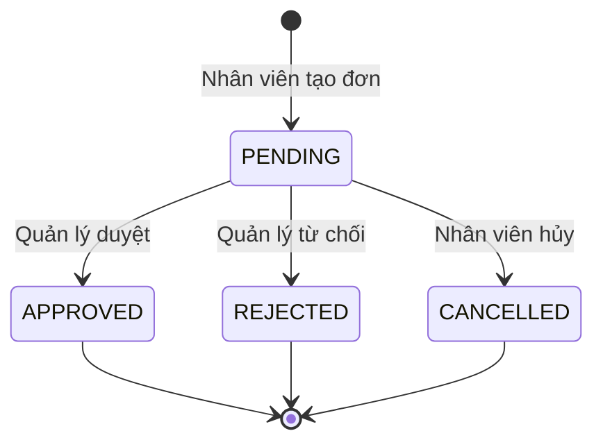
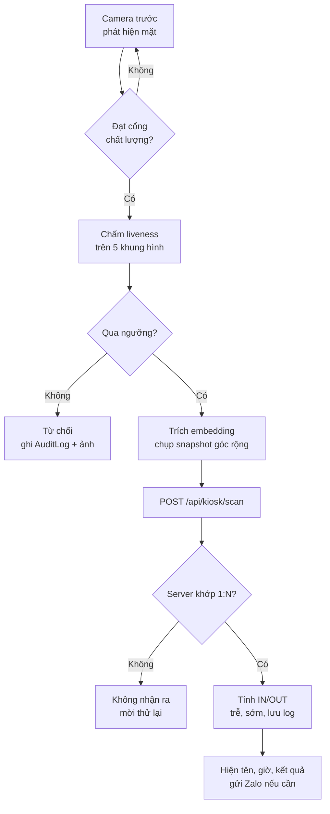

# PRD v2 — Face Beo

Cập nhật: 19/09/2026

## 1. Tổng quan

Face Beo là web app quản trị nhân sự, xếp ca, chấm công khuôn mặt trên tablet kiosk và thông báo Zalo OA cho 100 nhân viên. Bản v2 vá ba lỗ hổng của v1: thiếu đăng ký khuôn mặt, chống giả mạo không khả thi, và không có phân quyền.

### Phạm vi

- Trong phạm vi: đăng nhập và phân quyền, xếp ca, đơn nghỉ/về sớm/OT, enroll khuôn mặt, kiosk chấm công, tính trễ/sớm/OT, xuất Excel, thông báo Zalo OA, job kiểm tra vắng mặt.
- Ngoài phạm vi v2: tính lương, nhiều chi nhánh, app native, tích hợp máy chấm công phần cứng.

### Tech stack

| Lớp | Lựa chọn | Ghi chú |
| --- | --- | --- |
| Web | Next.js (App Router), TypeScript, TailwindCSS | Mobile-first, responsive desktop |
| CSDL | SQLite + Prisma, bật WAL | Self-host trên 1 máy chủ; không deploy serverless. Schema giữ tương thích để đổi sang Postgres |
| Nhận diện | `@vladmandic/human` (detect, mesh, embedding, antispoof, liveness) | Thay face-api.js đã ngừng bảo trì |
| Xác thực | Session cookie JWT (`jose`) + `bcryptjs` | Không phụ thuộc dịch vụ ngoài |
| Validate | `zod` cho mọi API input | |
| Thời gian | `luxon`, múi giờ cố định Asia/Ho_Chi_Minh | DB lưu UTC |
| Excel | `xlsx` (SheetJS), tạo file phía server | |
| Scheduler | `node-cron` trong tiến trình server + API trigger có `CRON_SECRET` | |
| Test | `vitest` | Bắt buộc cho logic chấm công |

### Thay đổi chính so với v1

| Vấn đề ở v1 | Cách vá ở v2 |
| --- | --- |
| Không có nơi lưu dữ liệu khuôn mặt | Bảng `FaceTemplate` + luồng enroll có ghi nhận đồng ý |
| Face Mesh Z không phải độ sâu thật | Liveness thụ động 3 lớp, server không tin cờ từ client |
| Không có đăng nhập, không biết ai là quản lý | Vai trò ADMIN/MANAGER/EMPLOYEE, `Department.managerId`, token thiết bị kiosk |
| Logic IN/OUT, ca đêm, ân hạn, OT bỏ trống | Mục 4 định nghĩa đầy đủ, có unit test |
| Token Zalo tĩnh trong `.env` | Lưu token trong DB, tự refresh, luồng liên kết `zaloUserId` |
| Trigger vắng mặt không có lịch chạy, dễ gửi trùng | Cron 5 phút + `NotificationLog.dedupeKey` |
| Không có tiêu chí nghiệm thu | Mục 10: checklist và test bắt buộc |

## 2. Vai trò, xác thực và phân quyền

Mọi API đều yêu cầu danh tính: người dùng đăng nhập bằng session, kiosk dùng token thiết bị. Không có route nghiệp vụ nào mở công khai.

| Vai trò | Phạm vi dữ liệu | Quyền |
| --- | --- | --- |
| ADMIN | Toàn công ty | Quản lý nhân viên, ca, thiết bị, enroll khuôn mặt, sửa công thủ công, xuất Excel, cấu hình |
| MANAGER | Phòng ban mình quản lý | Xếp ca, duyệt/từ chối đơn, xem dashboard và bảng công của phòng |
| EMPLOYEE | Chỉ dữ liệu của mình | Xem lịch tuần, xem công, tạo và hủy đơn đang PENDING, liên kết Zalo |
| KIOSK (thiết bị) | Không đọc dữ liệu nhân sự | Chỉ gọi `POST /api/kiosk/scan` và `GET /api/kiosk/ping` |

### Đăng nhập người dùng

- Đăng nhập bằng mã nhân viên hoặc số điện thoại, kèm mật khẩu. Mật khẩu băm bằng bcrypt.
- Session là JWT ký bằng `SESSION_SECRET`, đặt trong cookie `httpOnly`, `secure`, `sameSite=lax`, hạn 7 ngày.
- Lần đăng nhập đầu bắt buộc đổi mật khẩu (`mustChangePassword`).
- Khóa đăng nhập 15 phút sau 5 lần sai liên tiếp.
- `middleware.ts` chặn theo tiền tố: `/admin/*` cần ADMIN hoặc MANAGER, `/me/*` cần đăng nhập, `/kiosk` cần token thiết bị.
- Mọi API kiểm tra lại quyền ở server, kể cả phạm vi phòng ban của MANAGER.

### Xác định "Quản lý" của một nhân viên

Quản lý của nhân viên là `Department.managerId` của phòng ban người đó. Nếu phòng chưa có quản lý, hoặc người tạo đơn chính là quản lý, đơn chuyển cho tất cả ADMIN.

### Ghép thiết bị kiosk

1. ADMIN tạo thiết bị tại `/admin/devices`, hệ thống sinh mã ghép 6 số, hạn 10 phút.
2. Tablet mở `/kiosk/pair`, nhập mã, nhận token thiết bị và lưu vào cookie `httpOnly`.
3. Server chỉ lưu `tokenHash`. ADMIN có thể thu hồi thiết bị bất cứ lúc nào.

### Nhật ký kiểm toán

Ghi `AuditLog` cho: duyệt đơn, sửa công thủ công, enroll hoặc xóa khuôn mặt, ghép và thu hồi thiết bị, đổi cấu hình, lần quét bị từ chối vì nghi giả mạo.

## 3. Schema Prisma v2

Schema giữ nguyên 6 bảng của v1 và thêm 8 bảng: `FaceTemplate`, `KioskDevice`, `Holiday`, `NotificationLog`, `ZaloToken`, `ZaloLinkCode`, `AuditLog`, `AppSetting`. Các trường kiểu liệt kê dùng `String` và validate bằng zod, để không phụ thuộc hỗ trợ enum của SQLite.

```prisma
generator client {
  provider = "prisma-client-js"
}

datasource db {
  provider = "sqlite"
  url      = env("DATABASE_URL")
}

model Department {
  id        Int        @id @default(autoincrement())
  name      String     @unique
  managerId Int?
  manager   Employee?  @relation("DeptManager", fields: [managerId], references: [id])
  employees Employee[] @relation("DeptMembers")
}

model Employee {
  id                 Int               @id @default(autoincrement())
  code               String            @unique
  name               String
  phone              String            @unique
  passwordHash       String
  mustChangePassword Boolean           @default(true)
  role               String            @default("EMPLOYEE") // ADMIN | MANAGER | EMPLOYEE
  zaloUserId         String?           @unique
  zaloLinkedAt       DateTime?
  departmentId       Int
  department         Department        @relation("DeptMembers", fields: [departmentId], references: [id])
  managedDepartments Department[]      @relation("DeptManager")
  defaultShiftId     Int
  defaultShift       Shift             @relation(fields: [defaultShiftId], references: [id])
  avatarUrl          String?
  active             Boolean           @default(true)
  biometricConsentAt DateTime?
  failedLogins       Int               @default(0)
  lockedUntil        DateTime?
  createdAt          DateTime          @default(now())
  schedules          WorkSchedule[]
  logs               AttendanceLog[]
  faceTemplates      FaceTemplate[]
  requests           LeaveRequest[]    @relation("Requester")
  decidedRequests    LeaveRequest[]    @relation("Approver")
  notifications      NotificationLog[]
}

model Shift {
  id                Int             @id @default(autoincrement())
  name              String          @unique
  startTime         String          // "HH:mm" giờ VN
  endTime           String          // "HH:mm"; endTime <= startTime nghĩa là ca qua đêm
  breakMinutes      Int             @default(60)
  graceLateMinutes  Int             @default(5)
  graceEarlyMinutes Int             @default(0)
  employees         Employee[]
  schedules         WorkSchedule[]
  logs              AttendanceLog[]
}

model WorkSchedule {
  id         Int      @id @default(autoincrement())
  employeeId Int
  employee   Employee @relation(fields: [employeeId], references: [id])
  date       String   // "YYYY-MM-DD", ngày công theo giờ VN
  shiftId    Int?
  shift      Shift?   @relation(fields: [shiftId], references: [id])
  isDayOff   Boolean  @default(false)

  @@unique([employeeId, date])
  @@index([date])
}

model Holiday {
  date String @id // "YYYY-MM-DD"
  name String
}

model FaceTemplate {
  id           Int      @id @default(autoincrement())
  employeeId   Int
  employee     Employee @relation(fields: [employeeId], references: [id], onDelete: Cascade)
  descriptor   Bytes    // Float32Array, mã hóa AES-256-GCM bằng BIOMETRIC_KEY
  modelVersion String
  createdById  Int
  createdAt    DateTime @default(now())

  @@index([employeeId])
}

model KioskDevice {
  id            Int             @id @default(autoincrement())
  name          String
  location      String?
  tokenHash     String?         @unique
  pairCode      String?
  pairExpiresAt DateTime?
  active        Boolean         @default(true)
  lastSeenAt    DateTime?
  logs          AttendanceLog[]
}

model AttendanceLog {
  id                 Int          @id @default(autoincrement())
  employeeId         Int
  employee           Employee     @relation(fields: [employeeId], references: [id])
  workDate           String       // ngày công mà lần quét thuộc về
  shiftId            Int?
  shift              Shift?       @relation(fields: [shiftId], references: [id])
  checkTime          DateTime     // UTC
  type               String       // IN | OUT
  isLate             Boolean      @default(false)
  lateMinutes        Int          @default(0)
  isEarly            Boolean      @default(false)
  earlyMinutes       Int          @default(0)
  excusedByRequestId Int?
  snapshotUrl        String?
  verified3D         Boolean      @default(false) // kết luận liveness do SERVER đặt
  livenessScore      Float?
  matchScore         Float?
  source             String       @default("KIOSK") // KIOSK | MANUAL
  deviceId           Int?
  device             KioskDevice? @relation(fields: [deviceId], references: [id])
  clientEventId      String?      @unique // chống ghi trùng khi đồng bộ offline
  note               String?
  createdById        Int?
  createdAt          DateTime     @default(now())

  @@index([employeeId, workDate])
  @@index([workDate])
}

model LeaveRequest {
  id           Int       @id @default(autoincrement())
  employeeId   Int
  employee     Employee  @relation("Requester", fields: [employeeId], references: [id])
  type         String    // NGHI_PHEP | VE_SOM | TANG_CA_OT
  fromTime     DateTime
  toTime       DateTime
  reason       String
  status       String    @default("PENDING") // PENDING | APPROVED | REJECTED | CANCELLED
  approverId   Int?
  approver     Employee? @relation("Approver", fields: [approverId], references: [id])
  decidedAt    DateTime?
  decisionNote String?
  createdAt    DateTime  @default(now())

  @@index([employeeId, status])
}

model NotificationLog {
  id           Int      @id @default(autoincrement())
  dedupeKey    String   @unique
  toEmployeeId Int
  toEmployee   Employee @relation(fields: [toEmployeeId], references: [id])
  messageType  String
  payload      String   // JSON
  status       String   // SENT | SIMULATED | FAILED | SKIPPED_NO_ZALO
  error        String?
  createdAt    DateTime @default(now())
}

model ZaloToken {
  id           Int      @id @default(1)
  accessToken  String
  refreshToken String
  expiresAt    DateTime
  updatedAt    DateTime @updatedAt
}

model ZaloLinkCode {
  code       String   @id
  employeeId Int
  expiresAt  DateTime
}

model AuditLog {
  id        Int      @id @default(autoincrement())
  actorId   Int?
  action    String
  entity    String
  entityId  String?
  detail    String?  // JSON
  createdAt DateTime @default(now())
}

model AppSetting {
  key   String @id
  value String
}
```

### Seed dữ liệu mẫu

- 5 phòng ban: Hành chính, Kinh doanh, Kỹ thuật, Kho vận, Chăm sóc khách hàng. Mỗi phòng có 1 quản lý.
- 3 ca: Hành chính 08:00–17:00, Sáng sớm 07:00–17:00, Ca đêm 22:00–06:00. Ca đêm có mặt để test ca qua đêm.
- 15 nhân viên: 1 ADMIN, 5 MANAGER, 9 EMPLOYEE. 9 người ca cố định (60%), 6 người xoay ca (40%) có `WorkSchedule` cho tuần này và tuần sau.
- Mật khẩu mặc định `123456`, bắt buộc đổi ở lần đăng nhập đầu. In danh sách tài khoản ra console sau khi seed.
- 2 ngày lễ mẫu, 3 đơn mẫu (mỗi trạng thái một đơn), 1 kiosk mẫu kèm mã ghép in ra console.
- Không seed `FaceTemplate`: khuôn mặt phải enroll thật. Seed thêm vài `AttendanceLog` nguồn MANUAL để dashboard và Excel có dữ liệu ngay.
- `AppSetting` mặc định: `matchThreshold`, `livenessThreshold`, `absentAfterMinutes=30`, `snapshotRetentionDays=90`, `otRoundMinutes=15`.

## 4. Quy tắc nghiệp vụ chấm công

Toàn bộ phép tính nằm trong hàm thuần `src/lib/attendance.ts`, không truy cập DB, để unit test được từng trường hợp. API chỉ nạp dữ liệu rồi gọi hàm này.

### Thời gian và ngày công

- DB lưu `DateTime` dạng UTC. Mọi phép tính đổi sang Asia/Ho_Chi_Minh bằng luxon, không phụ thuộc múi giờ của máy chủ.
- `workDate` là chuỗi `YYYY-MM-DD` của ngày ca **bắt đầu**. Ca đêm 22:00 ngày 19 đến 06:00 ngày 20 thuộc ngày công 19.
- Ca qua đêm được nhận biết khi `endTime <= startTime`; giờ kết thúc cộng thêm 1 ngày.

### Xác định ca của một ngày

1. Có `WorkSchedule` cho (nhân viên, ngày): dùng `shiftId` của nó, hoặc ngày nghỉ nếu `isDayOff`.
2. Không có: dùng `defaultShift`, trừ Chủ nhật và ngày trong `Holiday`.
3. Cửa sổ chấm công của ca là từ `start − 120 phút` đến `end + 240 phút`.

### Gán lần quét vào ca và xác định IN/OUT

- Khi có lần quét, xét ca của hôm qua, hôm nay và ngày mai; chọn ca có cửa sổ chứa giờ quét. Nếu hai cửa sổ chồng nhau, chọn ca có mốc bắt đầu hoặc kết thúc gần giờ quét nhất.
- Không ca nào khớp: vẫn lưu log với `shiftId = null`, đánh dấu "ngoài ca" để ADMIN xem xét.
- Lần quét hợp lệ đầu tiên trong cửa sổ là `IN`. Mọi lần sau là `OUT`; lần `OUT` cuối cùng được dùng để tính công.
- Chống quét trùng: cùng nhân viên quét lại trong 120 giây thì không tạo log, kiosk báo "Bạn đã chấm lúc HH:mm".

### Đi trễ và về sớm

- `lateMinutes = max(0, giờ IN − giờ bắt đầu hiệu lực)`. `isLate = lateMinutes > graceLateMinutes`.
- Khi đã vượt ân hạn, số phút trễ tính từ giờ bắt đầu ca, không trừ ân hạn. *(Giả định cần xác nhận: vào 08:06 là trễ 6 phút, không phải 1 phút.)*
- `earlyMinutes = max(0, giờ kết thúc hiệu lực − giờ OUT cuối)`. `isEarly = earlyMinutes > graceEarlyMinutes`. Giá trị này được tính lại mỗi lần có `OUT` mới.
- Giờ hiệu lực: đơn `NGHI_PHEP` đã duyệt phủ đầu ca thì giờ bắt đầu hiệu lực dời đến `toTime` của đơn. Đơn `VE_SOM` hoặc `NGHI_PHEP` đã duyệt phủ cuối ca thì giờ kết thúc hiệu lực lùi về `fromTime` của đơn.
- Khi đơn đã duyệt làm thay đổi kết quả, ghi `excusedByRequestId` để báo cáo truy vết được.

### Vắng mặt, thiếu giờ ra, giờ công và OT

- Vắng mặt: quá `absentAfterMinutes` (mặc định 30) sau giờ bắt đầu hiệu lực mà chưa có `IN` và không có đơn `NGHI_PHEP` đã duyệt phủ cả ca.
- Thiếu giờ ra: hết cửa sổ ca mà chỉ có `IN`. Ngày đó hiện cờ "thiếu giờ ra"; ADMIN bổ sung log `MANUAL` kèm lý do, có ghi `AuditLog`.
- Giờ công = (OUT cuối − IN) − `breakMinutes`, chặn trên bằng độ dài ca trừ giờ nghỉ.
- OT chỉ tính khi có đơn `TANG_CA_OT` đã duyệt. Phút OT = phần giao giữa khoảng thời gian của đơn và thời gian có mặt thực tế ngoài ca, làm tròn xuống theo `otRoundMinutes` (15 phút).
- Ngày lễ: không cảnh báo vắng mặt. Nếu có chấm công thì đánh dấu "làm ngày lễ" trong bảng công.

### Khi nào nhắc đi trễ

Gửi nhắc khi `isLate = true` và không có đơn APPROVED hoặc PENDING phủ giờ bắt đầu ca. Đơn PENDING không bị nhắc vì quản lý đã nhận được thông báo về đơn đó.

## 5. Phân hệ Quản trị và Nhân viên

Một codebase phục vụ cả hai: `/admin/*` tối ưu cho máy tính nhưng dùng được trên điện thoại, `/me/*` thiết kế cho điện thoại trước.

| Route | Vai trò | Nội dung |
| --- | --- | --- |
| `/login` | Tất cả | Đăng nhập, đổi mật khẩu lần đầu |
| `/admin` | ADMIN, MANAGER | Dashboard hôm nay |
| `/admin/roster` | ADMIN, MANAGER | Bảng xếp ca tuần dạng lưới |
| `/admin/requests` | ADMIN, MANAGER | Danh sách đơn, duyệt hoặc từ chối |
| `/admin/attendance` | ADMIN, MANAGER | Log chấm công, ảnh snapshot, cờ bất thường; ADMIN sửa công thủ công |
| `/admin/reports` | ADMIN, MANAGER | Bảng công tổng hợp, nút xuất Excel |
| `/admin/employees` | ADMIN | CRUD nhân viên, enroll khuôn mặt, trạng thái liên kết Zalo |
| `/admin/devices` | ADMIN | Ghép và thu hồi kiosk |
| `/admin/settings` | ADMIN | Ca làm việc, ngày lễ, ngưỡng, thời hạn lưu ảnh |
| `/me` | EMPLOYEE trở lên | Lịch làm việc tuần, trạng thái công hôm nay |
| `/me/requests` | EMPLOYEE trở lên | Danh sách đơn của tôi, tạo đơn mới, hủy đơn PENDING |
| `/me/attendance` | EMPLOYEE trở lên | Lịch sử công theo tháng |
| `/me/zalo` | EMPLOYEE trở lên | Mã liên kết Zalo OA |

### Dashboard hôm nay

Năm thẻ số liệu, tính theo định nghĩa ở mục 4: Đúng giờ, Đi trễ, Vắng mặt, Nghỉ có phép, Chưa đến ca. Bên dưới là danh sách người trễ và vắng, lọc theo phòng ban. Dữ liệu tự làm mới mỗi 60 giây. MANAGER chỉ thấy phòng của mình.

### Bảng xếp ca tuần

- Hàng là nhân viên, 7 cột là các ngày trong tuần. Cột tên dính bên trái khi cuộn ngang trên điện thoại.
- Ô trống hiển thị ca mặc định màu xám. Bấm ô để chọn ca hoặc "Nghỉ"; lưu ngay bằng upsert theo `(employeeId, date)`.
- Thao tác nhanh: chọn nhiều ô rồi gán một ca, sao chép tuần trước, lọc theo phòng ban, chỉ hiện nhóm xoay ca.
- Không cho sửa ngày đã qua nếu ngày đó đã có log chấm công, trừ ADMIN.

### Luồng đơn



Tạo đơn thì báo Zalo cho quản lý; duyệt hoặc từ chối thì báo Zalo cho nhân viên. Khi duyệt một đơn thuộc ngày đã có log, hệ thống tính lại trễ/sớm của ngày đó.

- Form tạo đơn: chọn loại bằng 3 nút lớn, chọn ngày giờ, lý do tối thiểu 10 ký tự. `VE_SOM` và `TANG_CA_OT` tự điền sẵn theo ca hôm đó.
- Validate: `toTime > fromTime`, không trùng thời gian với đơn PENDING hoặc APPROVED cùng loại, không tạo đơn nghỉ cho ngày đã qua quá 3 ngày.
- Từ chối bắt buộc nhập `decisionNote`.

### Xuất Excel

`GET /api/reports/attendance.xlsx?from=&to=&departmentId=` tạo file phía server, tên `BangCong_YYYYMMDD_YYYYMMDD.xlsx`, gồm 2 sheet:

- **Tổng hợp**: mỗi nhân viên một dòng với mã, tên, phòng ban, ngày công, số lần trễ, tổng phút trễ, số lần về sớm, tổng phút về sớm, giờ OT, ngày nghỉ phép, ngày vắng không phép, số ngày thiếu giờ ra.
- **Chi tiết**: mỗi nhân viên mỗi ngày một dòng với ca, giờ vào, giờ ra, phút trễ, phút sớm, phút OT, ghi chú (đơn liên quan, sửa thủ công, làm ngày lễ).

## 6. Phân hệ Kiosk Tablet (/kiosk)

Kiosk chỉ phát hiện mặt, chấm liveness và trích embedding; việc so khớp danh tính và kết luận cuối cùng thuộc về server. Người dùng chỉ cần nhìn vào camera, không phải chớp mắt, cười hay quay đầu.

### Enroll khuôn mặt (bắt buộc trước khi chấm công)

1. ADMIN mở `/admin/employees/[id]/enroll` trên tablet hoặc máy có webcam.
2. Nhân viên đọc và tick đồng ý xử lý dữ liệu sinh trắc học. Hệ thống ghi `biometricConsentAt`; chưa đồng ý thì không enroll được.
3. Chụp 5 mẫu: nhìn thẳng, hơi trái, hơi phải, hơi ngẩng, hơi cúi. Việc đổi góc chỉ áp dụng lúc enroll, không áp dụng lúc chấm công.
4. Mỗi mẫu phải qua cổng chất lượng: đúng 1 khuôn mặt, mặt rộng từ 200 px, đủ sáng, không nhòe.
5. Server mã hóa từng embedding bằng AES-256-GCM rồi lưu `FaceTemplate` kèm `modelVersion`. Không lưu ảnh enroll.
6. Kiểm tra trùng: nếu embedding mới khớp với nhân viên khác trên ngưỡng thì cảnh báo ADMIN.

Nhân viên chưa enroll hiện nhãn "Chưa có khuôn mặt" trong danh sách. Nhân viên có quyền yêu cầu xóa mẫu; khi đó chuyển sang chấm công thủ công do quản lý xác nhận.

### Luồng quét



Toàn bộ luồng không yêu cầu thao tác nào; thẻ kết quả hiện 3 giây kèm âm báo rồi kiosk quay lại chờ.

- Cổng chất lượng: đúng 1 khuôn mặt, mặt rộng từ 180 px, góc lệch trong ±20°, ổn định 3 khung liên tiếp.
- Snapshot góc rộng: toàn khung camera 1280×720, JPEG chất lượng 0.7, gửi kèm mỗi lần quét thành công và mỗi lần bị từ chối vì nghi giả mạo.
- Request gồm: embedding, điểm liveness từng khung, snapshot, `clientEventId` (UUID), `capturedAt`. Header mang token thiết bị.

### Chống giả mạo thụ động

Tọa độ Z của Face Mesh do mô hình suy đoán từ ảnh 2D nên không được dùng làm tiêu chí quyết định. V2 dùng 3 lớp:

| Lớp | Cơ chế | Trạng thái |
| --- | --- | --- |
| L1 | Mô-đun `antispoof` và `liveness` của Human chạy trên kiosk, lấy trung bình 5 khung, so với `livenessThreshold` | Bắt buộc |
| L2 | Server chạy lại mô hình anti-spoof ONNX (họ MiniFASNet) trên vùng mặt cắt từ snapshot, bật bằng `LIVENESS_SERVER=true` | Tùy chọn, khuyến nghị trước khi chạy thật |
| L3 | Tablet có camera IR hoặc depth | Nâng cấp phần cứng, ngoài phạm vi code |

- Độ phẳng của mesh chỉ là tín hiệu phụ để ghi log, không tự nó từ chối hay chấp nhận.
- Server tự đặt `verified3D` từ điểm số nhận được và kết quả L2 nếu bật. Cờ boolean từ client bị bỏ qua.
- Giới hạn cần nói rõ với người dùng: camera RGB thường không thể chặn 100% video phát lại chất lượng cao. Bù lại bằng snapshot lưu vết, mục "lần quét đáng ngờ" cho quản lý xem lại, và kiosk đặt ở nơi có người qua lại.

### So khớp trên server

- Giải mã template vào bộ nhớ khi khởi động, làm mới khi có enroll. 100 người × 5 mẫu là 500 vector, so khớp tuyến tính dưới 5 ms.
- Độ tương đồng cosine; lấy điểm cao nhất của mỗi nhân viên. Chấp nhận khi top-1 ≥ `matchThreshold` (mặc định 0.55) và top-1 cao hơn top-2 ít nhất 0.05.
- Ngưỡng phải hiệu chỉnh trong giai đoạn pilot: ghi `matchScore` của mọi lần quét để ADMIN xem phân bố.
- `modelVersion` khác phiên bản hiện tại thì template bị bỏ qua và nhân viên được đánh dấu cần enroll lại.

### Hiệu năng

- Mục tiêu: p95 ≤ 1,5 giây từ lúc mặt ổn định đến lúc hiện kết quả, trên tablet tham chiếu Android 11+, RAM 4 GB, Chrome. Mốc "dưới 1 giây" của v1 chỉ là mục tiêu phấn đấu, phải đo thật.
- Nạp và warm-up mô hình khi mở trang. Backend WebGL, tự lùi về WASM nếu lỗi.
- Trang `/kiosk/benchmark` chạy 50 lượt và in p50, p95 để nghiệm thu trên thiết bị thật.

### Vận hành kiosk

- PWA toàn màn hình, khóa xoay ngang, giữ màn hình sáng bằng Wake Lock. Camera yêu cầu HTTPS.
- Hiển thị đồng hồ lớn, khung hướng dẫn đặt mặt, trạng thái mạng và số bản ghi đang chờ đồng bộ.
- Mất mạng: lưu embedding, snapshot, `capturedAt` vào hàng đợi IndexedDB và báo "Đã ghi nhận, sẽ xác nhận khi có mạng". Kiosk không giữ template nên không hiện tên khi offline.
- Có mạng lại: gửi tuần tự. Server chấp nhận `capturedAt` trong vòng 24 giờ, chống ghi trùng bằng `clientEventId`.
- Snapshot lưu tại `data/snapshots/YYYY/MM/DD/`, ngoài thư mục `public`, chỉ xem được qua route có kiểm tra quyền.

## 7. Dịch vụ thông báo Zalo OA

`src/lib/zalo-oa.ts` xuất một hàm duy nhất `sendZaloMessage({ toEmployeeId, messageType, data, dedupeKey })` và không bao giờ ném lỗi ra ngoài: lỗi gửi tin không được làm hỏng nghiệp vụ chấm công hay duyệt đơn. So với v1, tham số `toZaloId` đổi thành `toEmployeeId` để service tự tra `zaloUserId` và ghi log.

### Biến môi trường

| Biến | Mục đích |
| --- | --- |
| `ZALO_OA_APP_ID`, `ZALO_OA_SECRET` | Định danh ứng dụng, dùng khi refresh token |
| `ZALO_OA_ACCESS_TOKEN`, `ZALO_OA_REFRESH_TOKEN` | Chỉ dùng để khởi tạo bảng `ZaloToken` lần đầu |
| `ZALO_WEBHOOK_SECRET` | Xác minh chữ ký webhook |
| `SESSION_SECRET`, `BIOMETRIC_KEY`, `CRON_SECRET` | Ký session, mã hóa template, bảo vệ API trigger |
| `DATABASE_URL`, `APP_BASE_URL`, `LIVENESS_SERVER` | Hạ tầng |

### Chế độ mô phỏng

Thiếu bất kỳ biến Zalo nào thì service chạy ở chế độ mô phỏng: in ra console một khung có màu gồm người nhận, loại tin, nội dung đã render, rồi ghi `NotificationLog` với `status = SIMULATED`. Ứng dụng không crash và mọi luồng vẫn test được.

### Vòng đời token

- Access token của OA hết hạn sau khoảng 25 giờ. Refresh token sống khoảng 3 tháng và **chỉ dùng được một lần**; mỗi lần refresh trả về cặp token mới phải lưu lại ngay. Nguồn: [tài liệu Zalo về refresh token](https://developers.zalo.me/docs/api/official-account-api/xac-thuc-va-uy-quyen/cach-1-xac-thuc-voi-giao-thuc-oauth/lay-oa-access-token-tu-oa-refresh-token-post-4970), [thảo luận cộng đồng Zalo](https://developers.zalo.me/community/detail/51aaea53d6163f486607).
- `getAccessToken()` đọc `ZaloToken`; nếu còn dưới 60 phút thì refresh trong một transaction có khóa, tránh hai tiến trình cùng dùng một refresh token.
- Cron chạy mỗi 6 giờ để refresh chủ động. Refresh thất bại thì ghi log lỗi và hiện cảnh báo đỏ trên dashboard ADMIN.
- Gặp lỗi token không hợp lệ khi gửi: refresh một lần rồi gửi lại một lần.

### Liên kết `zaloUserId`

1. Nhân viên mở `/me/zalo`, nhận mã 6 ký tự hạn 15 phút và hướng dẫn quan tâm OA.
2. Nhân viên nhắn mã đó cho OA.
3. Webhook `POST /api/zalo/webhook` xác minh chữ ký, tìm mã trong `ZaloLinkCode`, lưu `zaloUserId` và `zaloLinkedAt`, rồi trả lời xác nhận.
4. Nhân viên chưa liên kết: tin được ghi `SKIPPED_NO_ZALO` và hiện trong mục thông báo của web app.

### Kịch bản thông báo

| `messageType` | Kích hoạt khi | Người nhận | `dedupeKey` |
| --- | --- | --- | --- |
| `REQUEST_CREATED` | Nhân viên tạo đơn | Quản lý phòng ban, hoặc tất cả ADMIN | `req-created:{requestId}:{managerId}` |
| `REQUEST_DECIDED` | Đơn được duyệt hoặc từ chối | Nhân viên tạo đơn | `req-decided:{requestId}` |
| `LATE_REMINDER` | Quét IN bị trễ, không có đơn phủ giờ vào | Chính nhân viên đó | `late:{employeeId}:{workDate}` |
| `ABSENT_WARNING` | Job đầu giờ phát hiện vắng mặt không phép | Chính nhân viên đó | `absent:{employeeId}:{workDate}` |
| `ABSENT_DIGEST` | Cuối mỗi lượt job có người vắng | Quản lý phòng ban | `absent-digest:{deptId}:{workDate}:{shiftId}` |

Mẫu nội dung nằm trong `src/lib/zalo-templates.ts`, mỗi loại một hàm nhận `data` và trả về chuỗi tiếng Việt kèm link về đúng trang trong web app.

### Chống gửi trùng và giới hạn

- Trước khi gửi, chèn `NotificationLog` với `dedupeKey`. Vi phạm unique nghĩa là đã gửi rồi, bỏ qua.
- Gửi thất bại: thử lại tối đa 3 lần với khoảng chờ tăng dần, sau đó ghi `FAILED` kèm lỗi.
- Câu hỏi mở: tin tư vấn của OA chỉ gửi được trong một khung thời gian sau khi người dùng tương tác; ngoài khung đó cần tin giao dịch hoặc ZNS có phí và template phải được duyệt. Cần xác minh chính sách và bảng giá hiện hành của Zalo trước khi chạy thật. Service tách `transport` riêng để đổi loại tin mà không sửa nghiệp vụ.

## 8. Scheduler và các job nền

Các job chạy bằng `node-cron` trong tiến trình server, và mỗi job cũng gọi được qua `POST /api/cron/{job}` với header `x-cron-secret` để dùng cron ngoài hoặc test tay. Mọi job đều idempotent: chạy lại nhiều lần không sinh dữ liệu hay tin nhắn trùng.

| Job | Lịch | Việc làm |
| --- | --- | --- |
| `absence-check` | Mỗi 5 phút | Tìm nhân viên vắng mặt theo định nghĩa ở mục 4, gửi `ABSENT_WARNING` và `ABSENT_DIGEST` |
| `missing-checkout` | Mỗi 30 phút | Gắn cờ "thiếu giờ ra" cho ca đã hết cửa sổ mà chỉ có `IN` |
| `zalo-token-refresh` | Mỗi 6 giờ | Refresh token chủ động |
| `snapshot-cleanup` | 02:00 hằng ngày | Xóa snapshot quá `snapshotRetentionDays`, xóa mã ghép và mã liên kết hết hạn |
| `db-backup` | 03:00 hằng ngày | Sao lưu file SQLite, giữ 14 bản gần nhất |

### Thuật toán `absence-check`

1. Lấy các ca có giờ bắt đầu hiệu lực nằm trong khoảng từ 6 giờ trước đến `absentAfterMinutes` phút trước thời điểm chạy.
2. Với mỗi nhân viên `active` thuộc ca đó hôm nay: bỏ qua nếu là ngày lễ, ngày nghỉ, đã có `IN`, hoặc có `NGHI_PHEP` đã duyệt phủ cả ca.
3. Đơn `NGHI_PHEP` đang PENDING: không cảnh báo nhân viên, nhưng đưa vào digest của quản lý với ghi chú "đơn chờ duyệt".
4. Còn lại: gửi `ABSENT_WARNING` với `dedupeKey` theo (nhân viên, ngày công). Mỗi người tối đa một tin mỗi ngày công.
5. Nhân viên chưa enroll khuôn mặt không bị cảnh báo; họ nằm trong danh sách "chấm công thủ công" của quản lý.

Giới hạn 6 giờ ở bước 1 bảo đảm khi server khởi động lại sau sự cố, job không gửi bù hàng loạt cảnh báo cũ.

## 9. Bảo mật, pháp lý và triển khai

Dữ liệu khuôn mặt là dữ liệu cá nhân nhạy cảm, nên hệ thống chỉ thu thập khi có sự đồng ý, mã hóa khi lưu và xóa đúng hạn. [Luật Bảo vệ dữ liệu cá nhân số 91/2025/QH15](https://luatvietnam.vn/tin-van-ban-moi/da-co-luat-bao-ve-du-lieu-ca-nhan-2025-so-91-2025-qh15-186-102925-article.html) có hiệu lực từ 01/01/2026, kèm [Nghị định 356/2025/NĐ-CP](https://ketoananpha.vn/nghi-dinh-356-2025-nd-cp) hướng dẫn thi hành. Phần dưới là yêu cầu kỹ thuật, không thay cho tư vấn pháp lý.

### Dữ liệu sinh trắc học

- Chỉ lưu embedding, không lưu ảnh enroll. Embedding mã hóa AES-256-GCM bằng `BIOMETRIC_KEY` để ngoài DB.
- Văn bản đồng ý nêu rõ mục đích (chấm công), loại dữ liệu, thời hạn lưu, quyền rút lại. Thời điểm đồng ý ghi vào `biometricConsentAt`.
- Nhân viên nghỉ việc (`active = false`): xóa `FaceTemplate` trong 30 ngày. Nhân viên rút đồng ý: xóa ngay, chuyển sang chấm công thủ công.
- Snapshot giữ 90 ngày theo `snapshotRetentionDays`, sau đó job tự xóa. Chỉ ADMIN và quản lý trực tiếp xem được.
- Kiosk không lưu template hay danh sách nhân viên. Hàng đợi offline bị xóa ngay sau khi đồng bộ thành công.
- Việc cần làm ngoài code: công ty lập hồ sơ đánh giá tác động xử lý dữ liệu cá nhân theo quy định hiện hành.

### Bảo mật ứng dụng

- Mọi input qua zod. Mọi API kiểm tra vai trò và phạm vi phòng ban ở server.
- Giới hạn tần suất: `/api/auth/login` 10 lượt mỗi phút mỗi IP; `/api/kiosk/scan` 60 lượt mỗi phút mỗi thiết bị.
- Webhook Zalo xác minh chữ ký. API cron yêu cầu `CRON_SECRET`.
- Không ghi embedding, token hay mật khẩu vào log. File `.env` không đưa vào git; có `.env.example` đầy đủ.
- Upload snapshot giới hạn 1 MB, chỉ nhận JPEG, tên file do server đặt.

### Triển khai

- Chạy trên 1 máy chủ hoặc VPS bằng `next start` dưới PM2 hoặc Docker, có volume bền cho `data/` (file SQLite, snapshot, bản sao lưu). Không dùng nền tảng serverless vì hệ thống file không bền.
- HTTPS bắt buộc, vì trình duyệt chỉ cấp quyền camera trên kết nối an toàn. Dùng Caddy hoặc Nginx kèm chứng chỉ Let's Encrypt.
- SQLite bật `journal_mode=WAL` và `busy_timeout=5000` khi khởi động. Tải 100 nhân viên với vài lượt quét mỗi giây giờ cao điểm nằm trong khả năng.
- Sao lưu hằng ngày bằng `VACUUM INTO`, giữ 14 bản; khuyến nghị đồng bộ thêm ra một nơi lưu trữ ngoài máy chủ.
- Đường nâng cấp: đổi `provider` sang `postgresql` khi vượt khoảng 500 nhân viên hoặc cần nhiều máy chủ.

## 10. Quy trình thực thi autonomous và nghiệm thu

Agent chạy 7 bước theo thứ tự; mỗi bước chỉ xong khi qua được cổng kiểm tra của nó, và agent tự sửa lỗi rồi chạy lại cổng trước khi đi tiếp.

| Bước | Việc làm | Cổng kiểm tra |
| --- | --- | --- |
| 1 | Khởi tạo Next.js + TypeScript + Tailwind, cài dependencies, tạo `.env.example`, cấu trúc thư mục | `npm run lint` và `tsc --noEmit` sạch |
| 2 | Viết `schema.prisma`, migrate, seed | `prisma migrate dev` và `prisma db seed` chạy lại được nhiều lần không lỗi |
| 3 | Viết `src/lib/attendance.ts` cùng unit test | Toàn bộ test ở danh sách dưới đạt |
| 4 | Auth, middleware, API routes, Zalo service, cron jobs | Test API cho phân quyền và dedupe đạt; chế độ mô phỏng Zalo in log đúng |
| 5 | Frontend Admin và Nhân viên | Kiểm tra ở bề rộng 375 px và 1280 px; không có cuộn ngang ngoài ý muốn |
| 6 | Kiosk: ghép thiết bị, enroll, quét, offline queue, benchmark | Quét giả lập bằng embedding mẫu qua API đạt; trang kiosk build không lỗi |
| 7 | `npm run build`, viết README | Build sạch, README có hướng dẫn cài, tài khoản seed, cách ghép kiosk, cách cấu hình Zalo |

### Unit test bắt buộc cho logic chấm công

- [ ] Ca hành chính: vào 07:58 đúng giờ; vào 08:04 trong ân hạn, không trễ; vào 08:06 trễ 6 phút.
- [ ] Ra 16:50 về sớm 10 phút; ra 17:20 không sớm; lần OUT sau ghi đè kết quả lần OUT trước.
- [ ] Ca đêm 22:00–06:00: IN 21:55 và OUT 06:05 hôm sau cùng thuộc `workDate` của ngày bắt đầu.
- [ ] Quét lại trong 120 giây không tạo log mới.
- [ ] Quét ngoài mọi cửa sổ ca tạo log "ngoài ca" với `shiftId = null`.
- [ ] `NGHI_PHEP` đã duyệt buổi sáng: vào 13:05 không bị tính trễ từ 08:00.
- [ ] `VE_SOM` đã duyệt từ 15:00: ra 15:02 không bị tính về sớm, có `excusedByRequestId`.
- [ ] OT: đơn 17:00–20:00, ra 19:40 thì được 150 phút; không có đơn đã duyệt thì 0 phút.
- [ ] Nhân viên xoay ca có `WorkSchedule` thì dùng ca đó; không có thì dùng `defaultShift`; `isDayOff` thì không bị tính vắng.
- [ ] Ngày lễ không sinh cảnh báo vắng mặt.
- [ ] Kết quả không đổi khi máy chủ đặt múi giờ UTC hay Asia/Ho_Chi_Minh.

### Test tích hợp bắt buộc

- [ ] EMPLOYEE gọi API admin nhận 403; MANAGER không đọc được dữ liệu phòng khác.
- [ ] `/api/kiosk/scan` không có token thiết bị nhận 401; token đã thu hồi nhận 401.
- [ ] Gửi hai lần cùng `clientEventId` chỉ tạo một log.
- [ ] Chạy `absence-check` hai lần liên tiếp chỉ sinh một `NotificationLog` cho mỗi người vắng.
- [ ] Tạo đơn sinh tin cho quản lý; duyệt đơn sinh tin cho nhân viên; trễ có đơn PENDING không sinh tin nhắc.
- [ ] Refresh token Zalo lưu lại cặp token mới; hai lời gọi đồng thời chỉ refresh một lần.
- [ ] File Excel xuất ra có đủ 2 sheet và tổng phút trễ khớp với dữ liệu seed.

### Nghiệm thu thủ công trên thiết bị thật

- [ ] Enroll 5 người thật, mỗi người quét 10 lần: nhận đúng từ 98%, không nhận nhầm người nào.
- [ ] Thử giả mạo bằng ảnh in, ảnh trên điện thoại và video trên tablet, mỗi loại 20 lần; ghi lại tỉ lệ bị từ chối để quyết định có bật lớp L2 hay không.
- [ ] `/kiosk/benchmark` trên tablet tham chiếu đạt p95 ≤ 1,5 giây.
- [ ] Tắt wifi, quét 3 lần, bật lại: cả 3 bản ghi lên server với đúng `capturedAt`.
- [ ] Liên kết Zalo thật cho 1 nhân viên và nhận đủ 4 loại tin.
